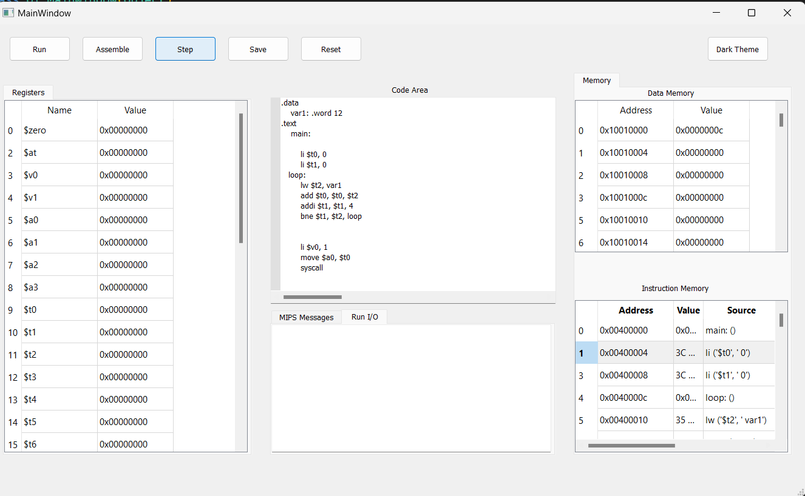

# MIPS Simulator

This project is a software that simulates the MIPS (Microprocessor without Interlocked Pipeline Stages) architecture. The MIPS simulator allows the execution of programs written in MIPS assembly language and facilitates the step-by-step execution, debugging, and analysis of these programs.

## Features

- **Instruction Execution**: Ability to execute MIPS assembly instructions step by step.
- **Memory Management**: Reading and writing of simulated memory.
- **Register Management**: Reading and writing of MIPS registers.
- **Debugging**: Step-by-step execution and support for breakpoints.
- **User Interface**: Control the simulator with a user-friendly interface.

## Screenshot

Here is a screenshot of the GUI:



## Project Files

- `data_memory.py`: Manages and operates on the data memory.
- `gui_python.py`: Contains the code for the user interface.
- `instruction_memory.py`: Manages and operates on the instruction memory.
- `.gitattributes`: Contains Git settings.

## Installation

To use this project, follow the steps below:

1. **Clone the Repository**:
    ```sh
    git clone https://github.com/your-username/mips-simulator.git
    cd mips-simulator
    ```

2. **Install Requirements**:
    Install the project dependencies by running:
    ```sh
    pip install -r requirements.txt
    ```

3. **Start the Simulator**:
    Run the project with:
    ```sh
    python gui_python.py
    ```

## Usage

After starting the simulator, you can load your MIPS assembly file and follow these steps:

1. **Load File**: Load the file containing your MIPS assembly code.
2. **Execution**: Execute instructions step by step or all at once.
3. **Memory and Register Monitoring**: Monitor the memory and registers.
4. **Debugging**: Add breakpoints and execute your code step by step.

## Contributing

If you want to contribute, please open an issue first to discuss what you would like to change. For major changes, please discuss what you would like to change via an issue first.

1. Fork the repository.
2. Create a new branch.
3. Make your changes.
4. Push to your branch.
5. Create a pull request.

## License

This project is licensed under the MIT License. See the `LICENSE` file for more information.

## Contact

If you have any questions or feedback, please contact us at [tolgatnh@gmail.com](mailto:tolgatnh@gmail.com).

---

